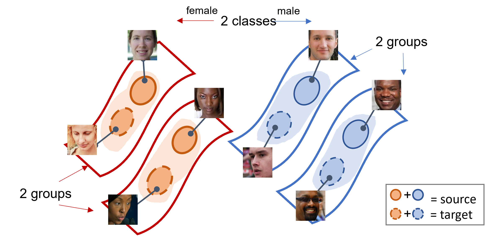

# transfer-fairness

<p align="center">
    </img>
</p>

This is the code for our NeurIPS paper <a href="https://openreview.net/pdf?id=zp_Cp38qJE0">
Transferring Fairness under Distribution Shifts via Fair
Consistency Regularization</a>. The code is contributed by Bang An and Zora Che. In this paper, we
study how to transfer fairness under distribution shifts. We propose a self-training method, the key
of which is to minimize and balance the consistency loss across groups via fair consistency
regularization.

# Datasets

* Our synthetic dataset is based on
  <a href="https://github.com/deepmind/3d-shapes">3dshapes </a> dataset. We save each image as .jpg
  file and use the index as its file name.
* The first experiment on real datasets is based on <a href="https://susanqq.github.io/UTKFace/">
  UTKFace </a> and <a href="https://github.com/joojs/fairface">FairFace </a> datasets. For UTKFace,
  we use "aligned&cropped faces". For FairFace, we use the Padding=0.25 version. The example indices
  used in our paper are under `data/UTKFace` and `data/fairface`.
* The second experiment on real datasets is based on NewAdult dataset with
  the <a href="https://github.com/zykls/folktables">Folktables </a> package. We do `ACSIncome`
  prediction task in our paper.
* Download data into `data` folder. The file structure would be
```
.
├── data
    ├── shapes
    │   └── images     
    ├── newadult
    │   └── 2018
    ├── fairface
    └── UTKFace
        └── UTKFace
```

# How to run

Followings are example running scripts for UTKFace-FairFace experiment:

1. Base

```
python laftr.py --dataset utk-fairface --model vgg16  --adv-hidden-dim 1024  --lr 0.001  --batch-size 100  \
--test-batch-size 256  --fair-weight 0  --val-epoch 5  --epoch 200   --train-iteration 50  --save-name face_base 
```

2. Laftr

```
python laftr.py --dataset utk-fairface --model vgg16  --adv-hidden-dim 1024  --lr 0.001  --batch-size 100  \
--test-batch-size 256  --fair-weight 1  --val-epoch 5  --epoch 200   --train-iteration 50  --save-name face_laftr 
```

3. CFair

```
python cfair.py --dataset utk-fairface --model vgg16  --adv-hidden-dim 1024  --lr 0.001  --batch-size 100  \
--test-batch-size 256  --fair-weight 1  --val-epoch 5  --epoch 200   --train-iteration 50  --save-name face_cfair 
```

4. Laftr+DANN

```
python laftr+dann.py --dataset utk-fairface --model vgg16  --adv-hidden-dim 1024  --lr 0.001  --batch-size 100  \
--test-batch-size 256  --fair-weight 1  --da-weight 1 --val-epoch 5  --epoch 200   --train-iteration 50  --save-name face_laftr_dann 
```

4. Laftr+FixMatch

```
python laftr+consis.py --dataset utk-fairface --model vgg16  --adv-hidden-dim 1024  --lr 0.001  --batch-size 100  \
--test-batch-size 256  --fair-weight 1  --consis-weight-source 1 --consis-weight-target 1 --val-epoch 5  --epoch 200   \
--train-iteration 50  --save-name face_laftr_fixmatch 
```

5. Ours (w/Laftr)

```
python laftr+consis.py --dataset utk-fairface --model vgg16  --adv-hidden-dim 1024  --lr 0.001  --batch-size 100  \
--test-batch-size 256  --fair-weight 1  --fair-consis --consis-weight-source 1 --consis-weight-target 1 --val-epoch 5  --epoch 200   \
--train-iteration 50  --save-name face_laftr_fairfixmatch 
```

# Citation

To cite our paper please use the following bibtex.

```bibtex
@inproceedings{
an2022transferring,
title={Transferring Fairness under Distribution Shifts via Fair Consistency Regularization},
author={Bang An and Zora Che and Mucong Ding and Furong Huang},
booktitle={Advances in Neural Information Processing Systems},
editor={Alice H. Oh and Alekh Agarwal and Danielle Belgrave and Kyunghyun Cho},
year={2022},
url={https://openreview.net/forum?id=zp_Cp38qJE0}
}
```

# Contact

Please contact bangan@umd.edu for any questions about the code.

# Reference

Parts of our code are based on or inspired by the following repositories. We sincerely thank the
contributors of them.

https://github.com/thuml/Transfer-Learning-Library

https://github.com/zykls/folktables

https://github.com/kekmodel/FixMatch-pytorch
